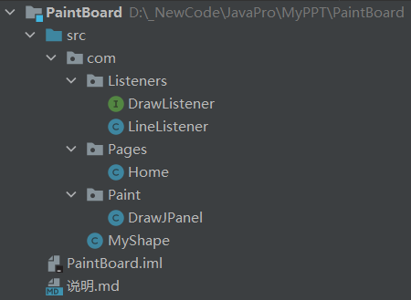

### 文件结构


### 代码框架
1. 首先写一个总的监听器抽象类。
```java
public abstract class DrawListener  extends MouseAdapter implements ActionListener{

    private Graphics2D listenerPen;

    //本监听器画的图形，用于本图形的删除和重绘，在图形的相同位置，用背景色画相同图形，但有产生了其它问题：
    //当更换背景颜色的时候，这些图形又会显现出来
    private Vector<Shape> listenerShapes = new Vector<>();


    /**
     *
     * @return 获得本监听器画笔，一般供子类调用
     */
    Graphics2D getListenerPen() {
        return listenerPen;
    }

    /**
     * 设置本监听器画笔
     * @param listenerPen 要换用的其他画笔
     */
    public void setListenerPen(Graphics2D listenerPen) {
        this.listenerPen = listenerPen;
    }

    public Vector<Shape> getListenerShapes() {
        return listenerShapes;
    }
}
```
每个按钮对应一个实现了`DrawListener`全部监听器接口的子类。当按下这个按钮的时候，则改变画板的监听器，从而实现同一画板上面画不同种类图形的功能。
2. 给出一个直线监听器的实现例子(不完善，需要老洪继续完善功能)
```java
public class LineListener extends DrawListener{

    //想办法把此监听器画的图形传出去
    int startX, startY;
    int endX, endY;

    @Override
    public void mouseClicked(MouseEvent e) {

    }

    @Override
    public void mousePressed(MouseEvent e) {
        startX = e.getX(); startY = e.getY();   //记录起点位置
    }

    @Override
    public void mouseReleased(MouseEvent e) {
        endX = e.getX(); endY = e.getY();   //记录终点位置
        Line2D line = new Line2D.Double(startX, startY, endX, endY);
        getListenerShapes().add(line);
        getListenerPen().draw(line);
    }

    @Override
    public void mouseEntered(MouseEvent e) {

    }

    @Override
    public void mouseExited(MouseEvent e) {

    }

    @Override
    public void actionPerformed(ActionEvent e) {

    }

    @Override
    public void mouseDragged(MouseEvent e) {

    }

    @Override
    public void mouseMoved(MouseEvent e) {

    }

    @Override
    public void mouseWheelMoved(MouseWheelEvent e) {
    }
}
```
图形的绘制过程中都是利用这些函数进行的。使用的画笔利用父类中的`getListenerPen()`获得。可以根据自己所绘制图形的特性，在每个图形监听器内增加需要的变量。`Vector<Shape> listenerShapes`是记录本监听器所绘制的图形的，将来用于图形的删除的选取。暂时先不用管。
3. 画板的实现
```java
public class DrawJPanel extends JPanel {

    Graphics2D drawBoardPen;  //画板的画笔通过监听器中的画笔展现。只有在父类容器可视化之后才能获得画笔！！
    DrawListener drawListener;  //画正在运行板的监听器，当按下不同的功能按钮的时候，将此监听器设置为按钮所对应的监听器
    Vector<DrawListener> preDrawListeners = new Vector<>();  //先前的监听器，监听器内部含有监听器画的图形

    /**
     * 外界通过获得本画板的画笔，从而达到在本画板画笔的基础上改变样式的功能
     * @return 本画板画笔
     */
    public Graphics2D getDrawBoardPen() {
        return drawBoardPen;
    }

    /**
     * 通过此函数来达到改变画板画笔样式的问题，实际上改变的是同本画板绑定的监听器的画笔。
     * @param afterChangingStylePen 本画板画笔修改样式后的画笔，但是同一只画笔，只是样式不同
     */
    public void setDrawBoardPen(Graphics2D afterChangingStylePen) {
        drawBoardPen = afterChangingStylePen;
        if(drawListener != null){   //等于空的时候说明还没有选择图像类型不同管
            drawListener.setListenerPen(afterChangingStylePen); //改变此画板绑定的监听器的画笔，就达到了改变样式的目的
        }
    }


    /**
     *
     * @param mouseListener  本画板需要改变成的监听器
     */
    public void setDrawListener(DrawListener mouseListener) {
        this.drawListener = mouseListener;
        if(mouseListener != null){
            this.drawListener.setListenerPen(this.drawBoardPen);    //将本画板之前拥有的样式画笔传给新的监听器
            preDrawListeners.add(drawListener);
        } //如果为空，说明目的是清空鼠标画笔，直接退出就完了。
        super.addMouseListener(this.drawListener);  //将监听器同本画板绑定，必须为本身的监听器，因为参数监听器的画笔样式没有改变
        super.addMouseMotionListener(this.drawListener);
    }

}
```
画板继承自`JPanel`类，画笔是和画板绑定在一起的，通过`JPanel`的`getGraphics`获得，然后强制类型转换为`Graphics2D`。
```java
drawBoard.setDrawBoardPen((Graphics2D) drawBoard.getGraphics());
```
在图形绘制的代码编辑过程中其实是不涉及画板类的，但是对图形绘制的监听器测试的时候需要用到。
4. 监听器和画板在界面`JFrame`中的用法

在界面先定义出画板
```java
private DrawJPanel drawBoard = new DrawJPanel();
```
定义一个直线按钮，定义**当鼠标点击的时候画板的监听器换成画直线的监听器**的监听器。
注意：**这里有两个监听器，一个是按钮本身的监听器，一个是画板的监听器。** 当按下按钮的时候，运作的是按钮的监听器。而这个监听器的功能是**改变画板的监听器**，从而实现通过点击不同按钮改变画板鼠标作画的图形的需求。
```java
//定义图形按钮
JButton lineButton = new JButton("直线");
lineButton.addMouseListener(new MouseAdapter() {
    @Override
    public void mouseClicked(MouseEvent e) {
        drawBoard.setDrawListener(new LineListener());
    }
});
```
先给出界面的代码，并将按钮和画板放置上去。*这里仅是测试，最简单的界面*
```java
//画出界面的大小
Dimension screenSize = Toolkit.getDefaultToolkit().getScreenSize();
setLocation((int)screenSize.getWidth() / 4, (int)screenSize.getHeight() / 4);
setSize((int)screenSize.getWidth() / 2, (int)screenSize.getHeight() / 2);
setDefaultCloseOperation(JFrame.DISPOSE_ON_CLOSE);
setTitle("测试画板");
//设置画板界面背景
drawBoard.setBackground(Color.CYAN);
setLayout(new BorderLayout());
add(BorderLayout.WEST, lineButton);
add(BorderLayout.CENTER,drawBoard);
```
界面运行代码。**首先要将界面可视化，然后获得画板的画笔，否则画板画笔会为空。**
```java
public void Run(){
    setVisible(true);
    drawBoard.setDrawBoardPen((Graphics2D) drawBoard.getGraphics());
}
```
界面**完整代码**
```java
public class Home extends JFrame {

    private DrawJPanel drawBoard = new DrawJPanel();

    public Home() throws HeadlessException {

        //定义图形按钮
        JButton lineButton = new JButton("直线");
        lineButton.addMouseListener(new MouseAdapter() {
            @Override
            public void mouseClicked(MouseEvent e) {
                drawBoard.setDrawListener(new LineListener());
            }
        });

        //画出界面的大小
        Dimension screenSize = Toolkit.getDefaultToolkit().getScreenSize();
        setLocation((int)screenSize.getWidth() / 4, (int)screenSize.getHeight() / 4);
        setSize((int)screenSize.getWidth() / 2, (int)screenSize.getHeight() / 2);
        setDefaultCloseOperation(JFrame.DISPOSE_ON_CLOSE);
        setTitle("测试画板");
        //设置画板界面背景
        drawBoard.setBackground(Color.CYAN);
        setLayout(new BorderLayout());
        add(BorderLayout.WEST, lineButton);
        add(BorderLayout.CENTER,drawBoard);
    }

    public void Run(){
        setVisible(true);
        drawBoard.setDrawBoardPen((Graphics2D) drawBoard.getGraphics());
    }

    public static void main(String[] args) {
        new Home().Run();
    }

}
```

